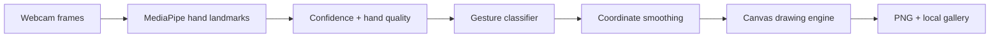

# HuruInk

<div align="center">

### Draw in the air. Leave ink on the screen.

**A privacy-friendly, browser-based gesture drawing studio powered by real-time hand tracking.**

[](https://bebecpp.github.io/HuruInk/)
[](https://github.com/BeBecpp/HuruInk/releases/tag/v2.0.0)
[](https://www.typescriptlang.org/)
[](https://ai.google.dev/edge/mediapipe/solutions/vision/hand_landmarker)

[Live demo](https://bebecpp.github.io/HuruInk/) · [How it works](#how-it-works) · [Run locally](#run-locally) · [v2 release](https://github.com/BeBecpp/HuruInk/releases/tag/v2.0.0)

</div>

---

## The idea

Webcams normally just record us. HuruInk asks a different question: **what if a webcam could understand what you want to create?**

Raise your hand and your index finger becomes a brush. HuruInk tracks hand landmarks in real time, translates gestures into drawing actions, and renders the result on an HTML Canvas—all inside the browser.

No account. No special controller. No camera feed uploaded to a server.

## Try it in 30 seconds

1. Open the **[live demo](https://bebecpp.github.io/HuruInk/)** on a laptop or desktop.
2. Allow camera access and keep your hand roughly 30–60 cm from the webcam.
3. Point with your index finger to draw.
4. Use two fingers to erase, open your palm to pause, or hold a fist to undo.
5. Save the result as a PNG or keep it in the local gallery.

> Best results: use even lighting, avoid strong backlight, and keep your full hand and wrist visible.

## Gesture language

| Gesture | Action | Reliability rule |
| :--- | :--- | :--- |
| ☝️ Index finger | Draw / hover | Smoothed landmark coordinates |
| ✌️ Two fingers | Erase | Hand-size-aware distance threshold |
| 🖐️ Open palm | Pause | Prevents accidental marks |
| ✊ Fist | Undo | Must remain stable for multiple frames; cooldown protected |

Keyboard controls are also available: `C` clear, `S` save, `D` draw, and `E` erase.

## How it works



The pipeline stays local to the browser. HuruInk selects the best detected hand, checks landmark quality, recognizes a small gesture vocabulary, smooths the cursor, and sends drawing actions to a high-DPI canvas.

## Engineering the “magic”

Hand tracking returning coordinates was only the beginning. The difficult part was making noisy predictions feel intentional.

- **Mirrored coordinates:** webcam video is mirrored like a familiar selfie view, so landmark positions are transformed to keep the cursor aligned with the user.
- **Adaptive gestures:** pinch thresholds scale with the apparent size of the hand instead of assuming a fixed camera distance.
- **Stable strokes:** point smoothing and minimum-distance filtering reduce jitter while quadratic curves keep lines natural.
- **Accident protection:** destructive gestures require sustained evidence and use cooldowns.
- **Graceful fallback:** tracking tries GPU first and falls back to CPU; MediaPipe WASM can load locally or from a CDN.
- **Useful failure states:** camera denial, model loading, low confidence, missing hands, and poor-lighting cases receive specific feedback.
- **Responsive canvas:** existing stroke coordinates rescale when the viewport changes, while device-pixel-ratio setup keeps exports sharp.

## Features

- Real-time browser hand tracking with MediaPipe Tasks Vision
- Gesture-controlled draw, erase, pause, and undo
- Colour and brush-size controls
- Smooth canvas strokes with undo and clear
- High-resolution PNG export
- Private browser gallery using `localStorage`
- GPU-to-CPU and local-to-CDN fallbacks
- Camera, tracking, confidence, and lighting guidance
- Debug view for FPS, confidence, gesture, and landmark state
- Responsive desktop and mobile interface

## Architecture

```text
src/
├── components/      Camera canvas, controls, status, gallery, debug UI
├── hooks/           Camera, hand tracking, drawing, local gallery
├── utils/           Gestures, geometry, smoothing, drawing, export
├── types/           Drawing and tracking contracts
├── App.tsx          Product flow and keyboard shortcuts
└── main.tsx         React entry point
```

| Layer | Technology |
| :--- | :--- |
| Interface | React 19, TypeScript, Tailwind CSS |
| Vision | MediaPipe Tasks Vision Hand Landmarker |
| Rendering | HTML Canvas 2D |
| Persistence | Browser `localStorage` |
| Build | Vite |
| Deployment | GitHub Pages |

## Run locally

```bash
git clone https://github.com/BeBecpp/HuruInk.git
cd HuruInk
npm install
npm run dev
```

Production checks:

```bash
npm run lint
npm run build
npm run preview
```

## From prototype to v2

HuruInk began as a computer-vision experiment. Version 2 turned it into a usable creative tool with explicit gestures, smoothing, adaptive thresholds, erasing, undo protection, PNG export, a local gallery, responsive UI, and clearer recovery states.

That process taught me an important lesson: an AI interaction is not finished when the model produces an output. It is finished when a person can trust what happens next.

See [CHANGELOG.md](./CHANGELOG.md) and [RELEASE_NOTES.md](./RELEASE_NOTES.md) for release details.

## Privacy and limitations

- Camera frames are processed in the browser and are not uploaded by HuruInk.
- Saved sketches stay in the browser unless the user downloads or removes them.
- Performance depends on browser support, hardware, lighting, and camera placement.
- HuruInk is an experimental creative interface, not an accessibility or safety device.

## AI-assisted development

Codex/ChatGPT helped with planning, debugging, UI iteration, and documentation. I reviewed, tested, and integrated the resulting changes and remain responsible for the shipped project.

## Author

Built by **Bayarbayasgalan Enkhtulga (Nero_404)**, a high-school AI and cybersecurity builder from Mongolia.

[GitHub](https://github.com/BeBecpp) · [Portfolio](https://bebecpp.github.io/my_blog/) · [LinkedIn](https://www.linkedin.com/in/bayarbayasgalan-enkhtulga-2219a13b9/)

---

<div align="center">

**HuruInk v2.0.0 — your hand is the brush.**

</div>
