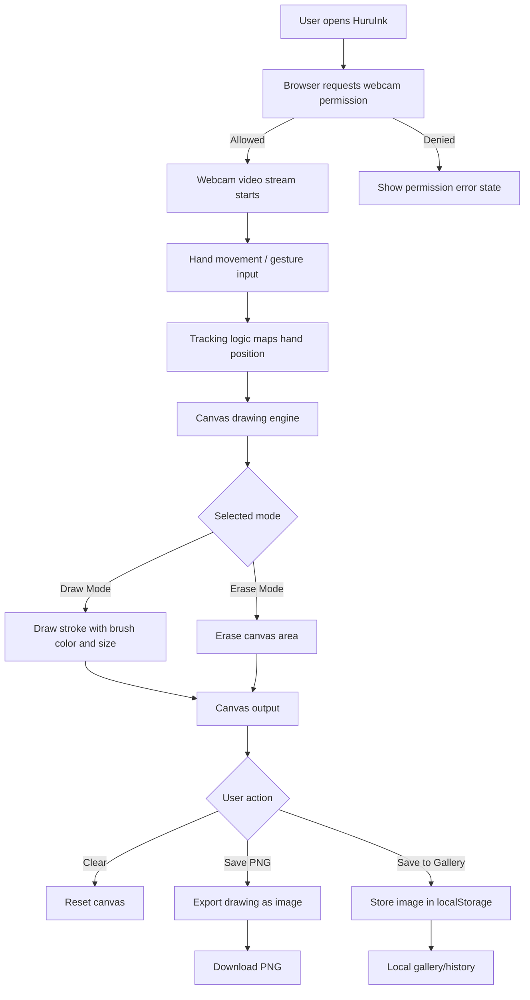

# HuruInk v2.0.0

<div align="center">


<br />

**Draw in the air with your hand — a webcam-powered gesture drawing app that turns movement into digital ink.**

<br />

[](https://github.com/BeBecpp/HuruInk/releases/tag/v2.0.0)
[](https://stardance.hackclub.com/)
[](https://react.dev/)
[](https://vitejs.dev/)
[](https://www.typescriptlang.org/)

<br />

[Live Demo](https://bebecpp.github.io/HuruInk/) ·
[GitHub Repo](https://github.com/BeBecpp/HuruInk) ·
[Release v2.0.0](https://github.com/BeBecpp/HuruInk/releases/tag/v2.0.0)

</div>

---

## Overview

**HuruInk** is a browser-based creative tool that lets users draw on a digital canvas using hand movement through their webcam.

The idea is simple: instead of using a mouse or stylus, your hand becomes the brush. HuruInk combines webcam input, gesture interaction, canvas drawing, and a polished frontend interface to create a fun air-drawing experience directly inside the browser.

This repository contains the **v2.0.0 Stardance upgrade**, where HuruInk was improved from an earlier prototype into a more complete open-source creative tool.

## What Changed in v2

HuruInk v2 is a major Stardance-focused upgrade of the original project.

### New in v2.0.0

* Improved webcam drawing experience
* Draw mode and erase mode
* Brush color picker
* Brush size control
* Clear canvas button
* Save drawing as PNG
* Local gallery/history using `localStorage`
* Better webcam permission loading and error states
* Cleaner landing/header section
* Responsive layout for desktop and mobile
* More polished visual design
* Updated documentation and release notes

---

## Core Features

### Webcam Gesture Drawing

Use your hand movement through the webcam to create digital strokes on the canvas.

### Draw and Erase Modes

Switch between drawing and erasing to control your artwork more naturally.

### Brush Controls

Customize your drawing with brush color and brush size controls.

### Save as PNG

Export your drawing as a PNG image and keep your creations outside the app.

### Local Gallery

Saved drawings can be stored locally in the browser using `localStorage`.

### Responsive UI

HuruInk is designed to work smoothly across different screen sizes with a clean, modern layout.

---

## HuruInk System Scheme



---

## Tech Stack

| Part       | Technology          |
| ---------- | ------------------- |
| Frontend   | React               |
| Language   | TypeScript          |
| Build Tool | Vite                |
| Styling    | CSS / responsive UI |
| Drawing    | HTML Canvas         |
| Storage    | localStorage        |
| Deployment | GitHub Pages        |
| Version    | v2.0.0              |

---

## Project Structure

```txt
HuruInk/
├── public/
│   └── screenshots/
│       ├── huruink-banner.png
│       ├── huruink-home.png
│       ├── huruink-drawing.png
│       └── huruink-gallery.png
├── src/
│   ├── components/
│   ├── assets/
│   ├── App.tsx
│   └── main.tsx
├── package.json
├── vite.config.ts
├── README.md
├── CHANGELOG.md
└── RELEASE_NOTES.md
```

---

## How to Run Locally

### 1. Clone the repository

```bash
git clone https://github.com/BeBecpp/HuruInk.git
cd HuruInk
```

### 2. Install dependencies

```bash
npm install
```

### 3. Start development server

```bash
npm run dev
```

### 4. Build for production

```bash
npm run build
```

### 5. Preview production build

```bash
npm run preview
```

---

## GitHub Pages Deployment

The live version is deployed with GitHub Pages:

```txt
https://bebecpp.github.io/HuruInk/
```

For Vite + GitHub Pages, the project uses this base path:

```ts
base: "/HuruInk/"
```

---

## Stardance Upgrade Note

This project was originally started before Stardance, but **v2.0.0** was created as a major upgrade for Hack Club Stardance.

For Stardance, I improved the original HuruInk project with a cleaner UI, better webcam drawing experience, brush controls, erase mode, PNG export, local gallery/history, responsive layout, and stronger documentation.

The goal was to turn HuruInk from a simple prototype into a more polished open-source creative tool that people can actually try and use.

---

## AI Usage Note

I used Codex/ChatGPT to help plan the v2 upgrade, improve the UI, debug issues, and write documentation. I reviewed and tested the generated changes myself.

---

## What I Learned

While upgrading HuruInk to v2, I practiced:

* Improving an existing project instead of starting from zero
* Building a more polished frontend interface
* Working with webcam-based browser interactions
* Handling user permission states
* Using canvas-based drawing logic
* Exporting drawings as PNG images
* Saving local data with `localStorage`
* Preparing a project for GitHub release and public demo
* Writing better open-source documentation

---

## Future Improvements

* More accurate hand gesture tracking
* Multi-hand support
* More brush styles
* Undo and redo controls
* Drawing layers
* Shareable drawing links
* Better mobile gesture support
* Optional AI-assisted drawing effects
* Online gallery mode

---

## Release

### HuruInk v2.0.0 — Stardance Upgrade

This release upgrades HuruInk from an early prototype into a more polished browser-based gesture drawing app.

**Release tag:** `v2.0.0`

**Release title:** `HuruInk v2.0.0 — Stardance Upgrade`

---

## Author

Built by **BeBe / Nero_404**

* Portfolio: https://bebecpp.github.io/my_blog/
* GitHub: https://github.com/BeBecpp/
* Team: https://notfound404.asuu.app/

---

## License

This project is open-source. You can use it, learn from it, and improve it.

</div>
